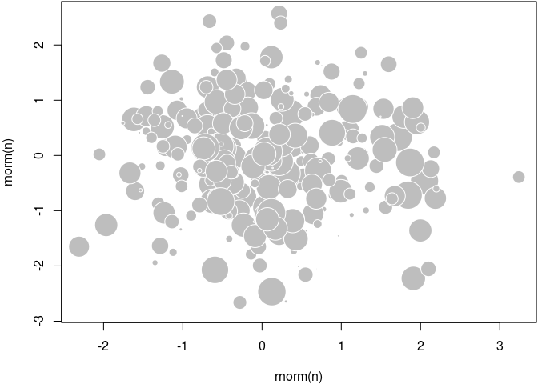
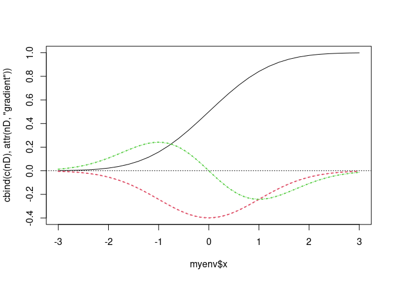

PEC 422/2014 ENTRY CONTENT<br/> Proposal for amendment to the
Constitution<br/> Situation Ready for agenda in plenary (Plen)<br/>
Proposition Identification
================

## Tree folder and files

``` r
# .
# ├── ccjc.png
# ├── ccp.png
# ├── doc-learn-pec244%2014.Rproj
# ├── license
# ├── matrix
# │   └── gnu
# │       ├── bin
# │       │   ├── i.R
# │       │   ├── ricd.R
# │       │   └── table.R
# │       ├── image
# │       ├── lib
# │       │   └── ccjc.R
# │       └── test
# │           └── ccp.R
# ├── readme_files
# │   └── figure-gfm
# │       ├── ccjc-1.png
# │       ├── ccp-1.png
# │       └── ricd-1.png
# ├── readme.md
# ├── readme.Rmd
# └── ricd.png
```

## bit::bit-demo demo of the bit package

``` r
#!/usr/bin/r

## ---- echo = FALSE, results = "hide", message = FALSE-------------------------
knitr::opts_chunk$set(collapse = TRUE, comment = "#>")
require(bit)
```

    ## Loading required package: bit

    ## 
    ## Attaching package: 'bit'

    ## The following object is masked from 'package:base':
    ## 
    ##     xor

``` r
.ff.version <- try(packageVersion("ff"), silent = TRUE)
.ff.is.available <- !inherits(.ff.version, "try-error") && .ff.version >= "4.0.0" && require(ff)
```

    ## Loading required package: ff

    ## Attaching package ff

    ## - getOption("fftempdir")=="/tmp/RtmpTFXVAi/ff"

    ## - getOption("ffextension")=="ff"

    ## - getOption("ffdrop")==TRUE

    ## - getOption("fffinonexit")==TRUE

    ## - getOption("ffpagesize")==65536

    ## - getOption("ffcaching")=="mmnoflush"  -- consider "ffeachflush" if your system stalls on large writes

    ## - getOption("ffbatchbytes")==16777216 -- consider a different value for tuning your system

    ## - getOption("ffmaxbytes")==536870912 -- consider a different value for tuning your system

    ## 
    ## Attaching package: 'ff'

    ## The following objects are masked from 'package:utils':
    ## 
    ##     write.csv, write.csv2

    ## The following objects are masked from 'package:base':
    ## 
    ##     is.factor, is.ordered

``` r
#tools::buildVignette("vignettes/bit-demo.Rmd")
#devtools::build_vignettes()

## -----------------------------------------------------------------------------
n <- 1e8
b1 <- bit(n)
b1
```

    ## bit length=100000000 occupying only 3125000 int32
    ##         1         2         3         4         5         6         7         8 
    ##     FALSE     FALSE     FALSE     FALSE     FALSE     FALSE     FALSE     FALSE 
    ##            99999993  99999994  99999995  99999996  99999997  99999998  99999999 
    ##        ..     FALSE     FALSE     FALSE     FALSE     FALSE     FALSE     FALSE 
    ## 100000000 
    ##     FALSE

``` r
## -----------------------------------------------------------------------------
object.size(b1)/n
```

    ## 0.1 bytes

``` r
## -----------------------------------------------------------------------------
b1[10:30] <- TRUE
summary(b1)
```

    ##    FALSE     TRUE     Min.     Max. 
    ## 99999979       21       10       30

``` r
## -----------------------------------------------------------------------------
b2 <- bit(n)
b2[20:40] <- TRUE
b2
```

    ## bit length=100000000 occupying only 3125000 int32
    ##         1         2         3         4         5         6         7         8 
    ##     FALSE     FALSE     FALSE     FALSE     FALSE     FALSE     FALSE     FALSE 
    ##            99999993  99999994  99999995  99999996  99999997  99999998  99999999 
    ##        ..     FALSE     FALSE     FALSE     FALSE     FALSE     FALSE     FALSE 
    ## 100000000 
    ##     FALSE

``` r
## -----------------------------------------------------------------------------
b1 & b2
```

    ## bit length=100000000 occupying only 3125000 int32
    ##         1         2         3         4         5         6         7         8 
    ##     FALSE     FALSE     FALSE     FALSE     FALSE     FALSE     FALSE     FALSE 
    ##            99999993  99999994  99999995  99999996  99999997  99999998  99999999 
    ##        ..     FALSE     FALSE     FALSE     FALSE     FALSE     FALSE     FALSE 
    ## 100000000 
    ##     FALSE

``` r
## -----------------------------------------------------------------------------
summary(b1 & b2)
```

    ##    FALSE     TRUE     Min.     Max. 
    ## 99999989       11       20       30

``` r
## -----------------------------------------------------------------------------
w1 <- as.bitwhich(b1) 
w2 <- as.bitwhich(b2)
object.size(w1)/n
```

    ## 0 bytes

``` r
## -----------------------------------------------------------------------------
w1 & w2
```

    ## bitwhich: 11/100000000 occupying only 11 int32 in 1 representation
    ##         1         2         3         4         5         6         7         8 
    ##     FALSE     FALSE     FALSE     FALSE     FALSE     FALSE     FALSE     FALSE 
    ##            99999993  99999994  99999995  99999996  99999997  99999998  99999999 
    ##        ..     FALSE     FALSE     FALSE     FALSE     FALSE     FALSE     FALSE 
    ## 100000000 
    ##     FALSE

``` r
## -----------------------------------------------------------------------------
summary(w1 & w2)
```

    ##    FALSE     TRUE     Min.     Max. 
    ## 99999989       11       20       30

``` r
## -----------------------------------------------------------------------------
summary(b1 & w2)
```

    ##    FALSE     TRUE     Min.     Max. 
    ## 99999989       11       20       30

``` r
## -----------------------------------------------------------------------------
summary(b1, range=c(1,1000))
```

    ## FALSE  TRUE  Min.  Max. 
    ##   979    21    10    30

``` r
## -----------------------------------------------------------------------------
as.which(b1, range=c(1, 1000))
```

    ##  [1] 10 11 12 13 14 15 16 17 18 19 20 21 22 23 24 25 26 27 28 29 30
    ## attr(,"maxindex")
    ## [1] 100000000
    ## attr(,"class")
    ## [1] "booltype" "which"

``` r
## -----------------------------------------------------------------------------
lapply(chunk(from=1, to=n, length=10), function(i)as.which(b1, range=i))
```

    ## $`1:10000000`
    ##  [1] 10 11 12 13 14 15 16 17 18 19 20 21 22 23 24 25 26 27 28 29 30
    ## attr(,"maxindex")
    ## [1] 100000000
    ## attr(,"class")
    ## [1] "booltype" "which"   
    ## 
    ## $`10000001:20000000`
    ## integer(0)
    ## attr(,"maxindex")
    ## [1] 100000000
    ## attr(,"class")
    ## [1] "booltype" "which"   
    ## 
    ## $`20000001:30000000`
    ## integer(0)
    ## attr(,"maxindex")
    ## [1] 100000000
    ## attr(,"class")
    ## [1] "booltype" "which"   
    ## 
    ## $`30000001:40000000`
    ## integer(0)
    ## attr(,"maxindex")
    ## [1] 100000000
    ## attr(,"class")
    ## [1] "booltype" "which"   
    ## 
    ## $`40000001:50000000`
    ## integer(0)
    ## attr(,"maxindex")
    ## [1] 100000000
    ## attr(,"class")
    ## [1] "booltype" "which"   
    ## 
    ## $`50000001:60000000`
    ## integer(0)
    ## attr(,"maxindex")
    ## [1] 100000000
    ## attr(,"class")
    ## [1] "booltype" "which"   
    ## 
    ## $`60000001:70000000`
    ## integer(0)
    ## attr(,"maxindex")
    ## [1] 100000000
    ## attr(,"class")
    ## [1] "booltype" "which"   
    ## 
    ## $`70000001:80000000`
    ## integer(0)
    ## attr(,"maxindex")
    ## [1] 100000000
    ## attr(,"class")
    ## [1] "booltype" "which"   
    ## 
    ## $`80000001:90000000`
    ## integer(0)
    ## attr(,"maxindex")
    ## [1] 100000000
    ## attr(,"class")
    ## [1] "booltype" "which"   
    ## 
    ## $`90000001:100000000`
    ## integer(0)
    ## attr(,"maxindex")
    ## [1] 100000000
    ## attr(,"class")
    ## [1] "booltype" "which"

``` r
## ---- eval=.ff.is.available---------------------------------------------------
options(ffbatchbytes=1024^3)
x <- ff(vmode="single", length=n)
x[1:1000] <- runif(1000)
lapply(chunk(x, length.out = 10), function(i)sum(x[as.hi(b1, range=i)]))
```

    ## $`1:10000000`
    ## [1] 11.00201
    ## 
    ## $`10000001:20000000`
    ## [1] 0
    ## 
    ## $`20000001:30000000`
    ## [1] 0
    ## 
    ## $`30000001:40000000`
    ## [1] 0
    ## 
    ## $`40000001:50000000`
    ## [1] 0
    ## 
    ## $`50000001:60000000`
    ## [1] 0
    ## 
    ## $`60000001:70000000`
    ## [1] 0
    ## 
    ## $`70000001:80000000`
    ## [1] 0
    ## 
    ## $`80000001:90000000`
    ## [1] 0
    ## 
    ## $`90000001:100000000`
    ## [1] 0

``` r
## ---- eval=.ff.is.available---------------------------------------------------
delete(x)
```

    ## [1] TRUE

``` r
rm(x, b1, b2, w1, w2, n)
```

## Available methods

``` r
#!/usr/bin/r

## ----setup, include = FALSE---------------------------------------------------
knitr::opts_chunk$set(
  collapse = TRUE,
  comment = "#>"
)

## ----echo = FALSE, message = FALSE--------------------------------------------
library(broom)
library(dplyr)
#> 
#> Attaching package: 'dplyr'
#> The following object is masked from 'package:bit':
#> 
#>     symdiff
#> The following objects are masked from 'package:stats':
#> 
#>     filter, lag
#> The following objects are masked from 'package:base':
#> 
#>     intersect, setdiff, setequal, union
library(stringr)

method_df <- function(method_name) {
  m <- as.vector(methods(method_name))
  tibble::tibble(class = str_remove(m, str_c(method_name, "[.]")),
                 !!method_name := "x")
}

method_df("tidy") %>% 
  left_join(method_df("glance")) %>% 
  left_join(method_df("augment")) %>% 
  mutate_all(tidyr::replace_na, "") %>% 
  knitr::kable()
#> Joining with `by = join_by(class)`
#> Joining with `by = join_by(class)`
```

| class                    | tidy | glance | augment |
|:-------------------------|:-----|:-------|:--------|
| aareg                    | x    | x      |         |
| acf                      | x    |        |         |
| anova                    | x    | x      |         |
| aov                      | x    | x      |         |
| aovlist                  | x    |        |         |
| Arima                    | x    | x      |         |
| betamfx                  | x    | x      | x       |
| betareg                  | x    | x      | x       |
| biglm                    | x    | x      |         |
| binDesign                | x    | x      |         |
| binWidth                 | x    |        |         |
| boot                     | x    |        |         |
| btergm                   | x    |        |         |
| cch                      | x    | x      |         |
| character                | x    |        |         |
| cld                      | x    |        |         |
| clm                      | x    | x      | x       |
| clmm                     | x    | x      |         |
| coeftest                 | x    | x      |         |
| confint.glht             | x    |        |         |
| confusionMatrix          | x    |        |         |
| coxph                    | x    | x      | x       |
| crr                      | x    | x      |         |
| cv.glmnet                | x    | x      |         |
| data.frame               | x    | x      | x       |
| default                  | x    | x      | x       |
| density                  | x    |        |         |
| dist                     | x    |        |         |
| drc                      | x    | x      | x       |
| durbinWatsonTest         | x    | x      |         |
| emmGrid                  | x    |        |         |
| epi.2by2                 | x    |        |         |
| ergm                     | x    | x      |         |
| factanal                 | x    | x      | x       |
| felm                     | x    | x      | x       |
| fitdistr                 | x    | x      |         |
| fixest                   | x    | x      | x       |
| ftable                   | x    |        |         |
| gam                      | x    | x      | x       |
| Gam                      | x    | x      |         |
| garch                    | x    | x      |         |
| geeglm                   | x    | x      |         |
| glht                     | x    |        |         |
| glm                      | x    | x      | x       |
| glmnet                   | x    | x      |         |
| glmrob                   | x    |        | x       |
| glmRob                   | x    | x      | x       |
| gmm                      | x    | x      |         |
| htest                    | x    | x      | x       |
| ivreg                    | x    | x      | x       |
| kappa                    | x    |        |         |
| kde                      | x    |        |         |
| Kendall                  | x    |        |         |
| kmeans                   | x    | x      | x       |
| lavaan                   | x    | x      |         |
| leveneTest               | x    |        |         |
| Line                     | x    |        |         |
| Lines                    | x    |        |         |
| list                     | x    | x      |         |
| lm                       | x    | x      | x       |
| lm.beta                  | x    |        |         |
| lmodel2                  | x    | x      |         |
| lmrob                    | x    | x      | x       |
| lmRob                    | x    | x      | x       |
| logical                  | x    |        |         |
| logitmfx                 | x    | x      | x       |
| lsmobj                   | x    |        |         |
| manova                   | x    |        |         |
| map                      | x    |        |         |
| margins                  | x    | x      | x       |
| Mclust                   | x    | x      | x       |
| mediate                  | x    |        |         |
| mfx                      | x    | x      | x       |
| mjoint                   | x    | x      | x       |
| mle2                     | x    |        |         |
| mlm                      | x    |        |         |
| mlogit                   | x    | x      | x       |
| muhaz                    | x    | x      |         |
| multinom                 | x    | x      |         |
| negbin                   | x    | x      |         |
| negbinmfx                | x    | x      | x       |
| nlrq                     | x    | x      | x       |
| nls                      | x    | x      | x       |
| NULL                     | x    | x      | x       |
| numeric                  | x    |        |         |
| orcutt                   | x    | x      |         |
| pairwise.htest           | x    |        |         |
| pam                      | x    | x      | x       |
| plm                      | x    | x      | x       |
| poissonmfx               | x    | x      | x       |
| poLCA                    | x    | x      | x       |
| polr                     | x    | x      | x       |
| Polygon                  | x    |        |         |
| Polygons                 | x    |        |         |
| power.htest              | x    |        |         |
| prcomp                   | x    |        | x       |
| probitmfx                | x    | x      | x       |
| pyears                   | x    | x      |         |
| rcorr                    | x    |        |         |
| ref.grid                 | x    |        |         |
| regsubsets               | x    |        |         |
| ridgelm                  | x    | x      |         |
| rlm                      | x    | x      | x       |
| rma                      | x    | x      | x       |
| roc                      | x    |        |         |
| rq                       | x    | x      | x       |
| rqs                      | x    | x      | x       |
| sarlm                    | x    | x      | x       |
| Sarlm                    | x    | x      | x       |
| SpatialLinesDataFrame    | x    |        |         |
| SpatialPolygons          | x    |        |         |
| SpatialPolygonsDataFrame | x    |        |         |
| spec                     | x    |        |         |
| speedglm                 | x    | x      | x       |
| speedlm                  | x    | x      | x       |
| summary_emm              | x    |        |         |
| summary.glht             | x    |        |         |
| summary.lm               | x    | x      |         |
| summary.plm              | x    |        |         |
| summaryDefault           | x    | x      |         |
| survdiff                 | x    | x      |         |
| survexp                  | x    | x      |         |
| survfit                  | x    | x      |         |
| survreg                  | x    | x      | x       |
| svyglm                   | x    | x      |         |
| svyolr                   | x    | x      |         |
| systemfit                | x    |        |         |
| table                    | x    |        |         |
| tobit                    | x    |        |         |
| ts                       | x    |        |         |
| TukeyHSD                 | x    |        |         |
| varest                   | x    | x      |         |
| zoo                      | x    |        |         |

R Markdown with the Docco Classic Style This is an example of Markdown
vignettes using the Docco style.

Docco To use the Docco style for Markdown vignettes in an R package, you
need to

add \*.Rmd files under the vignettes directory add Suggests: knitr and
Vignette Builder: knitr to the DESCRIPTION file specify the vignette
engine in the Rmd files (inside HTML comments) After building and
installing the package, you can view vignettes via

browse Vignettes(package = ‘Your_Package’) ¶ Examples Below are some
code chunks as examples.

cat(‘*hello* **markdown**!’, ‘’) ¶ hello markdown!

Normally you do not need any chunk options.

1+1 \## \[1\] 2 10:1 \## \[1\] 10 9 8 7 6 5 4 3 2 1 rnorm(5)^2 \## \[1\]
0.26160 0.04578 0.03464 0.01449 1.02583 strsplit(‘hello, markdown
vignettes’, ’’) \## \[\[1\]\] \## \[1\] “h” “e” “l” “l” “o” “,” ” ” “m”
“a” “r” “k” “d” “o” “w” “n” ” ” “v” “i” “g” \## \[20\] “n” “e” “t” “t”
“e” “s” ¶ Feel free to draw beautiful plots and write math ¶ plot of
chunk unnamed-chunk-2

n=300; set.seed(123) par(mar=c(4,4,.1,.1)) plot(rnorm(n), rnorm(n),
pch=21, cex=5\*runif(n), col=‘white’, bg=‘gray’) ¶ How does it work The
markdown package (\>= v0.6.2) supports custom HTML templates, and the
docco engine in knitr uses a custom template to compile Markdown to
HTML:

head(knitr::rocco, 5) \##  
\## 1 function (input, …)  
\## 2 {  
\## 3 out = knit2html(input, …, meta = list(css = system.file(“misc”,  
\## 4 “docco-classic.css”, package = “knitr”)), template =
system.file(“misc”, \## 5 “docco-classic.html”, package = “knitr”)) ¶
That is it.

You probably have noticed that you can adjust the widths of the two
columns using your cursor. What is more, press T on your keyboard, and
see what happens.

``` r

#!/usr/bin/r
## ----hello, results='asis'----------------------------------------------------
cat('_hello_ **markdown**!', '\n')
#> _hello_ **markdown**!

## -----------------------------------------------------------------------------
1+1
#> [1] 2
10:1
#>  [1] 10  9  8  7  6  5  4  3  2  1
rnorm(5)^2
#> [1] 0.1050383 0.2574176 0.6919710 4.4733766 0.1644933
strsplit('hello, markdown vignettes', '')
#> [[1]]
#>  [1] "h" "e" "l" "l" "o" "," " " "m" "a" "r" "k" "d" "o" "w" "n" " " "v" "i" "g"
#> [20] "n" "e" "t" "t" "e" "s"

## -----------------------------------------------------------------------------
n=300; set.seed(123)
par(mar=c(4,4,.1,.1))
plot(rnorm(n), rnorm(n), pch=21, cex=5*runif(n), col='white', bg='gray')
```

<!-- -->

``` r

## -----------------------------------------------------------------------------
head(knitr::rocco, 5)
#>                                                                                    
#> 1 function (input, ...)                                                            
#> 2 {                                                                                
#> 3     out = knit2html(input, ..., meta = list(css = system.file("misc",            
#> 4         "docco-classic.css", package = "knitr")), template = system.file("misc", 
#> 5         "docco-classic.html", package = "knitr"))
```

``` r
#!/usr/bin/r

## ----hello, results='asis'----------------------------------------------------
cat('_hello_ **markdown**!', '\n')
#> _hello_ **markdown**!

## -----------------------------------------------------------------------------
1+1
#> [1] 2
10:1
#>  [1] 10  9  8  7  6  5  4  3  2  1
rnorm(5)^2
#> [1] 2.36676748 0.01203635 0.26160233 0.04577802 0.03464091
strsplit('hello, markdown vignettes', '')
#> [[1]]
#>  [1] "h" "e" "l" "l" "o" "," " " "m" "a" "r" "k" "d" "o" "w" "n" " " "v" "i" "g"
#> [20] "n" "e" "t" "t" "e" "s"

## -----------------------------------------------------------------------------
n=300; set.seed(123)
par(mar=c(4,4,.1,.1))
plot(rnorm(n), rnorm(n), pch=21, cex=5*runif(n), col='white', bg='gray')
```

<!-- -->

``` r

## ----header, eval=FALSE-------------------------------------------------------
#  knit2html(..., template = system.file('misc', 'docco-template.html', package='knitr'))
```

numericDeriv {stats} R Documentation Evaluate Derivatives Numerically
Description numericDeriv numerically evaluates the gradient of an
expression.

Usage numericDeriv(expr, theta, rho = parent.frame(), dir = 1, eps =
.Machine\$double.eps ^ (1/if(central) 3 else 2), central = FALSE)
Arguments expr  
expression or call to be differentiated. Should evaluate to a numeric
vector.

theta  
character vector of names of numeric variables used in expr.

rho environment containing all the variables needed to evaluate expr.

dir numeric vector of directions, typically with values in -1, 1 to use
for the finite differences; will be recycled to the length of theta.

eps a positive number, to be used as unit step size h for the
approximate numerical derivative (f(x+h)-f(x))/h or the central version,
see central.

central logical indicating if central divided differences should be
computed, i.e., (f(x+h) - f(x-h)) / 2h . These are typically more
accurate but need more evaluations of f().

Details This is a front end to the C function numeric_deriv, which is
described in Writing R Extensions.

The numeric variables must be of type double and not integer.

Value The value of eval(expr, envir = rho) plus a matrix attribute
“gradient”. The columns of this matrix are the derivatives of the value
with respect to the variables listed in theta.

Author(s) Saikat DebRoy <saikat@stat.wisc.edu>; tweaks and eps, central
options by R Core Team.

Examples

``` r
#!/usr/bin/r

myenv <- new.env()
myenv$mean <- 0.
myenv$sd   <- 1.
myenv$x    <- seq(-3., 3., length.out = 31)
nD <- numericDeriv(quote(pnorm(x, mean, sd)), c("mean", "sd"), myenv)
str(nD)
#>  num [1:31] 0.00135 0.00256 0.00466 0.0082 0.0139 ...
#>  - attr(*, "gradient")= num [1:31, 1:2] -0.00443 -0.00792 -0.01358 -0.02239 -0.03547 ...

## Visualize :
require(graphics)
matplot(myenv$x, cbind(c(nD), attr(nD, "gradient")), type="l")
abline(h=0, lty=3)
## "gradient" is close to the true derivatives, you don't see any diff.:
curve( - dnorm(x), col=2, lty=3, lwd=2, add=TRUE)
curve(-x*dnorm(x), col=3, lty=3, lwd=2, add=TRUE)
```

<!-- -->

``` r
##
## IGNORE_RDIFF_BEGIN
# shows 1.609e-8 on most platforms
all.equal(attr(nD,"gradient"),
          with(myenv, cbind(-dnorm(x), -x*dnorm(x))))
#> [1] "Mean relative difference: 1.609569e-08"
## IGNORE_RDIFF_END
```
